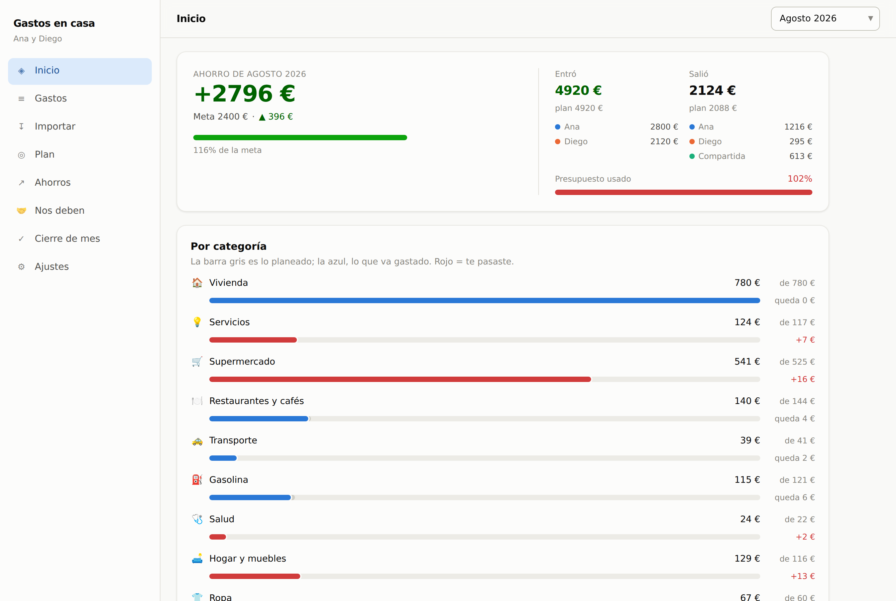
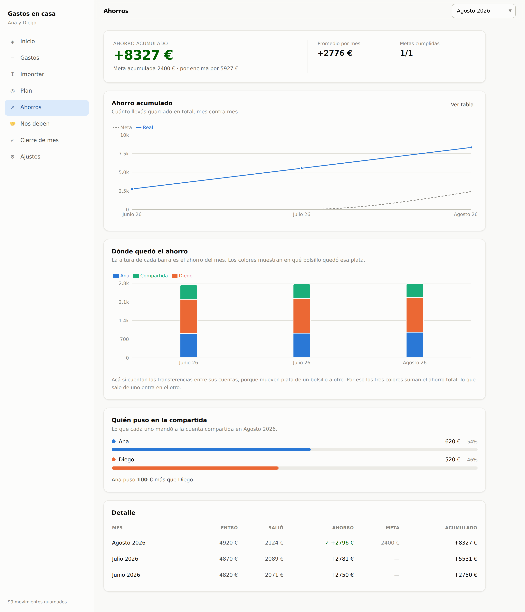
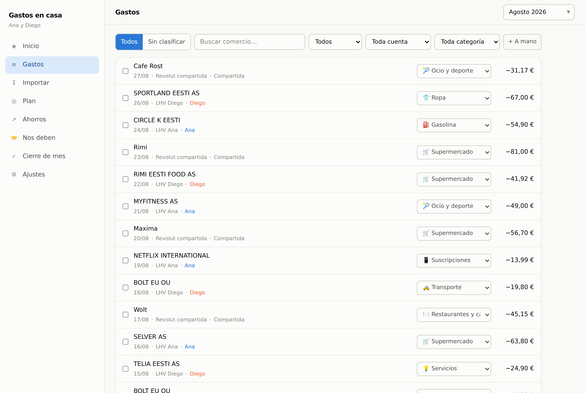

# gastos en casa

**control de gastos y ahorro para dos.** subís los extractos del banco, la app
clasifica sola, y cada mes ves cuánto entró, cuánto salió y cuánto quedó —
separado por persona y por cuenta.

### → **[abrir la app](https://matiascantella.github.io/gastos-en-casa/)**  ·  **[guía de uso](GUIA.md)**



funciona en el navegador, se instala en Android como una app más, y anda sin
internet. los datos son del hogar que la usa: no hay servidor de terceros en el medio.

---

## qué resuelve

llevar las cuentas en pareja se rompe siempre por lo mismo: cada uno tiene sus
cuentas en bancos distintos, hay una compartida, la plata se mueve entre ellas, y
a fin de mes nadie sabe cuánto gastaron de verdad ni cuánto le quedó a cada uno.
una planilla no lo resuelve porque hay que cargar todo a mano y porque cuenta dos
veces cada transferencia interna.

esta app arranca del extracto del banco y llega al número real.

- **importa los CSV de cuatro bancos** y los asigna solos a su dueño por IBAN.
- **clasifica el ~90% de los movimientos** en la primera importación, con reglas
  precargadas para más de sesenta comercios de Estonia.
- **aprende de vos**: cada corrección a mano se guarda como regla y el mes
  siguiente ya sale clasificada.
- **distingue el gasto real del movimiento interno.** la plata que va de una
  cuenta propia a la compartida no es un gasto, y contarla lo sería todo dos veces.
- **atribuye por persona y por bolsillo**, incluido quién puso cuánto en la
  cuenta compartida.
- **convierte a euros** los movimientos en otra moneda, con la cotización real
  que viene en el propio archivo.
- **netea devoluciones y descarta reversos**, autorizaciones canceladas y
  duplicados: reimportar el mismo archivo no ensucia nada.
- **plan contra realidad**: al principio del mes fijás ingresos, presupuesto por
  categoría y meta de ahorro; al final comparás y armás el mes siguiente con un clic.
- **préstamos aparte.** la plata que sale porque se la prestaste a alguien se
  sigue en su propia pantalla hasta que te la devuelven, sin ensuciar el gasto del mes.
- **sincroniza entre dispositivos** en tiempo real, con respaldo exportable a JSON.



## bancos soportados

| banco | dónde bajar el extracto | asignación |
|---|---|---|
| **LHV** | cuenta → extracto de cuenta | automática por IBAN |
| **Swedbank** | kontod → konto väljavõte → CSV | automática por IBAN (estonio o inglés) |
| **Wise** | saldo → extractos → historial de transacciones | automática por titular |
| **Revolut** | cuenta → extracto (CSV) | se elige una vez y queda recordada |

## empezar

1. abrí **[la app](https://matiascantella.github.io/gastos-en-casa/)** y cargá
   los dos nombres, las cuentas de cada uno y desde qué mes querés medir.
2. en **Ajustes → Cuentas**, poné el IBAN de cada cuenta. es lo que hace que los
   CSV se asignen solos.
3. en **Ajustes → Sincronización**, pegá la configuración de tu proyecto de
   Firebase para que los dos vean lo mismo desde el celular y la PC.

**la [guía de uso](GUIA.md) tiene el paso a paso completo**, desde crear el
proyecto de Firebase hasta el cierre de cada mes.

la app mide desde el mes que elijas en adelante. los extractos más viejos se
guardan en **Gastos → Histórico**: no cuentan en ningún número, pero sirven para
clasificar los comercios de una vez y arrancar con las reglas ya aprendidas.



## arquitectura de datos

cada hogar es dueño de su backend. la app corre desde una única copia publicada,
pero los datos de cada pareja viven en **su propio proyecto de Firebase**, con
reglas de seguridad que solo dejan entrar a los miembros de ese hogar. dos
parejas que usan la misma dirección nunca se ven entre sí, y quien publica la
app no tiene acceso a los datos de nadie.

sin nube configurada, todo queda en IndexedDB en el dispositivo y la app funciona igual.

la configuración de Firebase se pega desde Ajustes y se guarda en el navegador
de cada uno — no vive en este repositorio.

## publicar tu propia copia

```bash
npm ci
npm run build
```

el workflow de `.github/workflows/deploy.yml` compila y publica en GitHub Pages
en cada push a `main`. para que el login con Google funcione en tu dirección,
agregala una vez en tu proyecto de Firebase → **Authentication → Settings →
Authorized domains**.

## desarrollo

```bash
npm install
npm run dev              # servidor de desarrollo
npm run build            # build de producción → dist/
SINGLE=1 npm run build   # build en un único archivo HTML → dist-single/

npx tsx test/parse.test.ts     # parsers contra extractos reales
npx tsx test/pipeline.test.ts  # clasificación, atribución y totales
node test/e2e.mjs              # recorrido completo en un navegador real
node test/demo-shots.mjs       # capturas del README, con datos inventados
```

**stack:** React 19 · TypeScript · Vite · Tailwind · Dexie (IndexedDB) · Zustand ·
Recharts · Firebase (Auth + Firestore) · PWA con service worker.

```
src/
  types.ts            modelo de datos
  lib/
    parsers.ts        lee los CSV de cada banco y los normaliza
    classify.ts       reglas, categorías, dueño de cada movimiento
    calc.ts           resúmenes mensuales, ahorro, series
    seed.ts           categorías y reglas precargadas
    db.ts             persistencia local (Dexie)
    store.ts          estado de la app (Zustand)
    cloud.ts          sincronización con Firebase
    text.ts           normalización, reparación de acentos, hashes
  pages/              una pantalla por archivo
  components/ui.tsx   piezas compartidas
```

**para sumar un banco:** escribí una función `parseX` en `parsers.ts` que
devuelva `ParsedRow[]` y agregá su firma de columnas a `detectBank`. el resto
—clasificación, atribución, deduplicación, conversión— funciona sin tocar nada más.

## licencia

MIT
